<h1 align="center">Chef Tools Website</h1>

[view project here.](https://marmiteontoast.github.io/project-portfolio-1/)

This is the knife sharpening sign up website for the knife retail shop Chef tools. It is designed to be responsive and accessible on a range of divices, making it easy to naviagate for potential clients and customers.

<h2 align="center">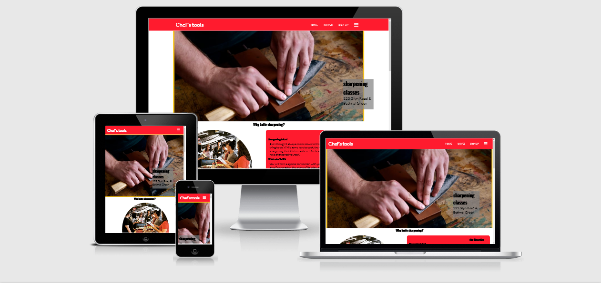</h2>

<h1>Features</h1>

- ## Navigation

    -  Featuring at the top of the page, it shows the name of the website in the left corner: Chefs Tools
    -  Navigation can be found on the right side: Home, Knives and sign up. The first link (Home) will bring you to the index page while the other two link to separte html pages.
    -  the navigation is in a Lato font style 
    -  One the far right of the navigation next sign up bar icon, and will activate when the browser reaches a certain width.
    -  the navigation is red and white combination, the whole navigation bar is a shade of red while the text and icon is white for contrast.
    -  the nav bar is responsive. scaling down the width past 911px will cause the links to disapear, the bar icon can now be used to reveal the nav links within a side menu.

<h2></h2>

  
  - ## The Header

    - The header consists of the "hero image" of a man sharpening a knife on a whetstone. 
    - There is a piece of text on the bottom right corner of the image provding the location. 
    - This section provides the visitor information and a visual of what the website is about. 

<h2>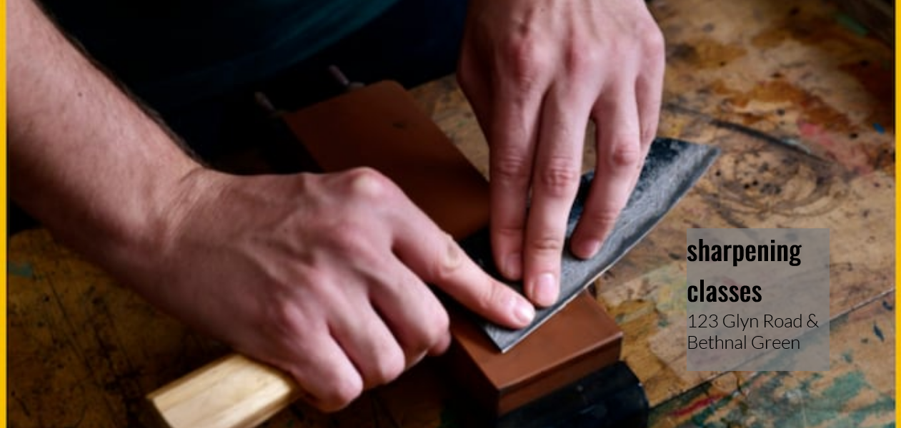</h2>

- ## about/Why Knife sharpening? section

    - This section provides a brief explanation of the benefits of learning to sharpen. 
    - The image gives the vistor a visual of what the classes would look like and how fun i can be. 
    - also shows that the classes are available for all genders.
    - the section is responsive once it reaches 911px or less the two divs will stack on top of each other and slightly reduce in size

<h2>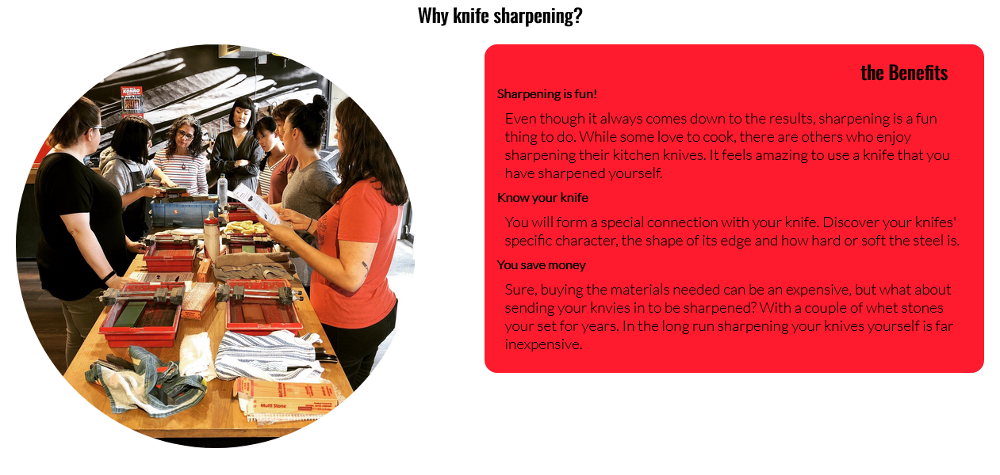</h2>

- ## Testimonails 

    - This section provides proof for the visitor that the participants found the classes informative and enjoyable 
    - shows visitors it's level of success and quality of service 
    - It shows visitors an unbised view and establishs customer trust.

    <h2>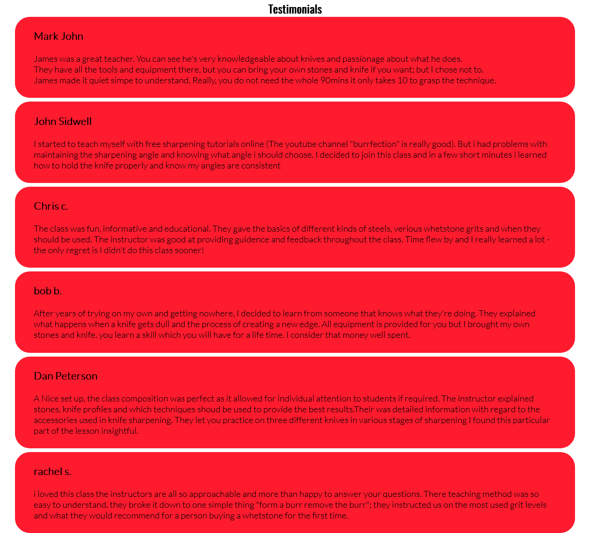</h2>

 - ## Times 

     - this sections providice visitor with the scedule, tiime and price of the classes 
     - this gives visitors the information on which class to pick from and best supports there scedule 
     - The times section is also a link to the sign up page, so visitors don't have to scroll back up the page to click to the next page.

<h2>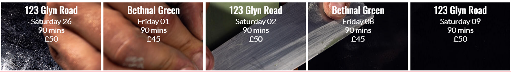</h2>

- ## Footer/contact section 

    - vistiors are provided with a phone number and email which ever is best for them to use.
    - the site also provides links to various social media accounts in the form of icons.
    - The section is important because it gives the visitor the ability to contact someone at chef tools for any sort of enquiries they may have.

<h2></h2>

- ## Knives Page

    - This section provides the vistitor with information on some of the various Japanese knifes 
    - It section gives a general understanding of a knife profile and provides an idea of what sharpening technique on wich to use.
    - pictures provide a visual of how the knife looks (knife profile vary according to knife maker)
    - The page is responsive and shrinks down to all media devices.

<h2>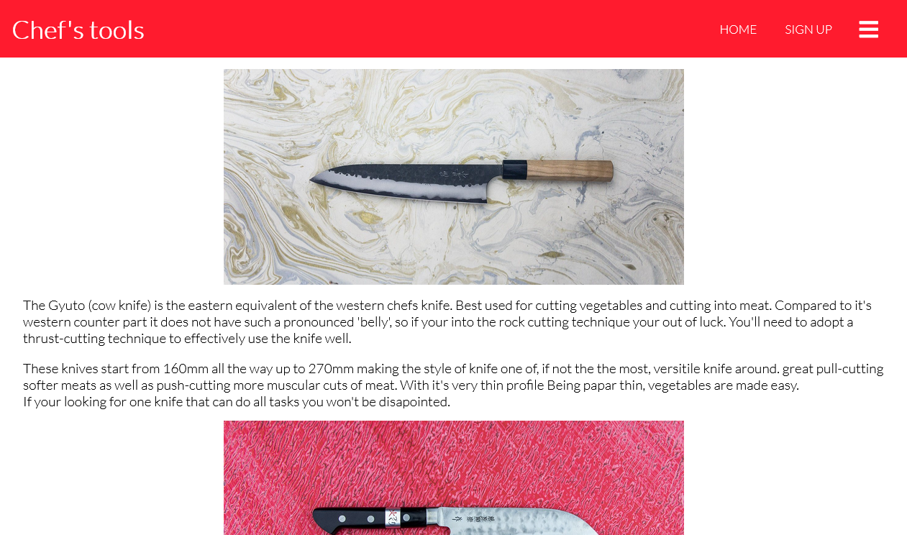</h2>

- ## sign up Page

    - this page consists of an image of a man sharpening a knife for its background 
    - on the top left corner there is a form with three boxes to input your name, sir name, and email adress. below that are buttons reprasenting the date the classes are on. 
    - this page provides the vistor to the chance to sign up for the sharpening class.

<h2>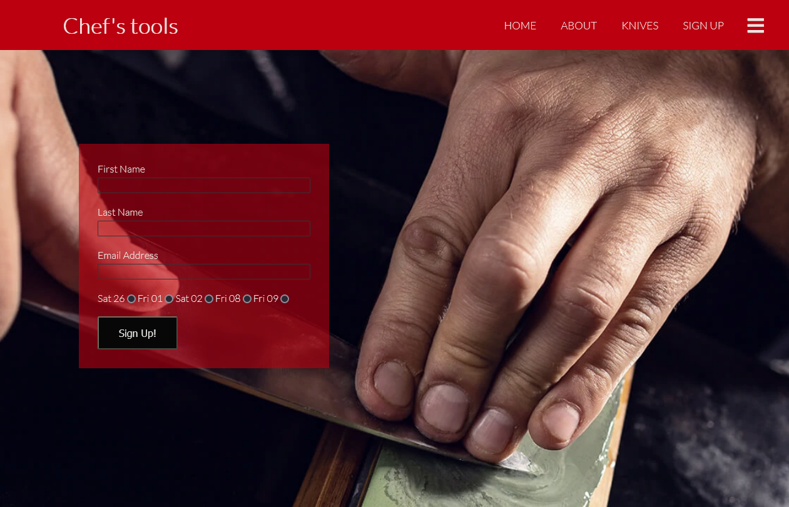</h2>

# Testing

 - I have tested the site and it works on browsers: Chrome, Firefox, and Safari.
 - I confirmed the site is responsive, looks great and functions on all current screen sizes using dev tools.
 - I confirmed all nav and social links function properly, and contact info is readable and clear to understand.
 - I have confirmed the form on the sign up page works: requires correct entries in all fields, will only accept first name, sir name, email address and the class you prefer. 

 ## bugs

### solved bugs:

 - when i reduced the screen size the the times section would create overflow passing through the footer.
 - I discovered it was the ul selector specifically "position: fixed", that was affecting all ul's on my index page.
    
  <h2>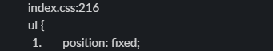</h2>

- removal of attribute fixed this as well as giving nav and footer elements separate ids.

## Validator Tesing 

- ### HTML
    - No errors detected when passing through official W3C validator

- ### CSS
    - No errors detected when passing through officail (Jigsaw) Validator

- ### Accessibility
    - I have confirmed that colors and font styles are readable, and accessibility is a high percentage for all pages on this project using lighthouse in devtools.

    - ### index
    <h2>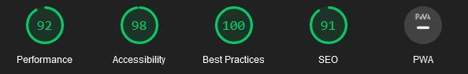</h2>

    - ### Knives
    <h2>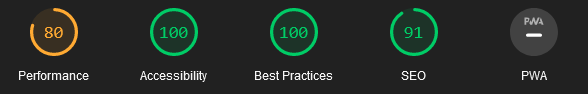</h2>

    - ### sign up
    <h2>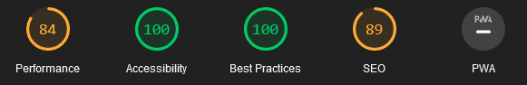</h2>

## unfixed bugs

- when the screen is expanded beyond 2000px the div that floats on top of the hero image all the the way to the right.

# Deployment

The site is deployed on GitHub. The steps to deploy are as follows:

- Click on repository 'project-portfolio-1' from my account. From there navigate to settings.
- scroll down to GitHub pages, there will be a link to navigate you to the next page.
- select main in the branch, then you will be provided a link that will take you to the completed website

[view project here.](https://marmiteontoast.github.io/project-portfolio-1/)    

# Credits

## Content

- the code to make the navigation bar was taken from a [youtube video](https://www.youtube.com/watch?v=oLgtucwjVII&list=PLMmcKEMXVzoKWH-ErijZhEH8T9yAT4htZ&index=1&t=197s) 
- the footer code was taken from love running project 

## Media 

- Got all knife pictures on the knives page from the site [knife wear](https://knifewear.com/)
- pictures on the index page was found through google search.

