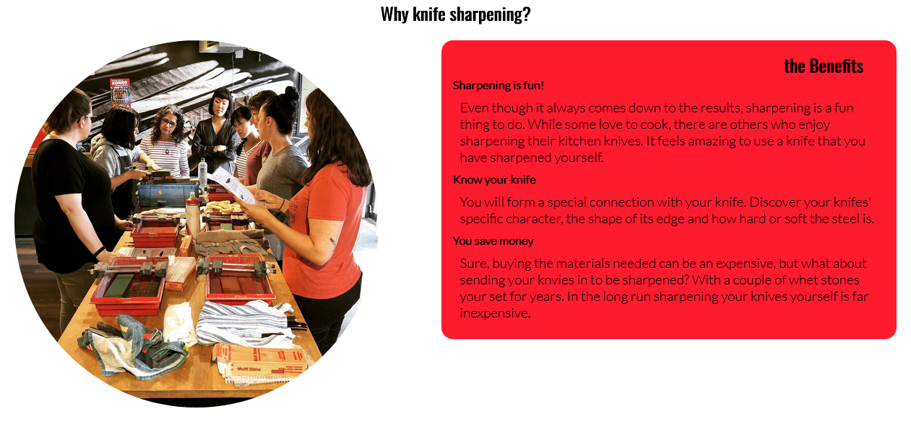

<h1 align="center">Chef Tools Website</h1>

[view project here.](https://marmiteontoast.github.io/project-portfolio-1/)

This is the knife sharpening sign up website for the knife retail shop Chef tools. It is designed to be responsive and accessible on a range of divices, making it easy to naviagate for potential clients and customers.

<h2 align="center"></h2>

<h1>Features</h1>

- ## Navigation

    -  Featuring at the top of the page, it shows the name of the website in the left corner: Chefs Tools
    -  Navigation can be found of the right side: Home, About, Knives and sign up. The first two link to various sections of the index page while the other two link to separte html pages.
    -  the navigation is in a Lato font style 
    -  One the far right of the navigation next sign up bar icon, and will activate when the browser reaches a sertain width.
    -  the navigation is red and white combination, the whole navigation bar is a shade of red while the text and icon is white for contrast.
    -  the nav bar is responsive. scaling down the width past 911px will cause the links to disapear, the bar icon can now be used to reveal the nav links within a side menu.

<h2></h2>

  
  - ## The Header

    - The header consists of the "hero image" of a man sharpening a knife on a whetstone. 
    - There is a piece of text on the bottom right corner of the image provding the location. 
    - This section provides the visitor information and a visual of what the website is about. 

<h2></h2>

- ## about/Why Knife sharpening? section

    - This section provides a brief explanation of the benefits of learning to sharpen. 
    - The image gives the vistor a visual of what the classes would look like and how fun i can be. 
    - also shows that the classes are available for all genders.

<h2></h2>